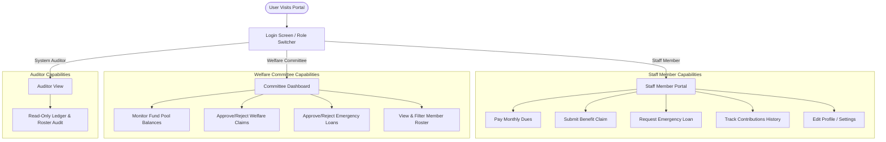
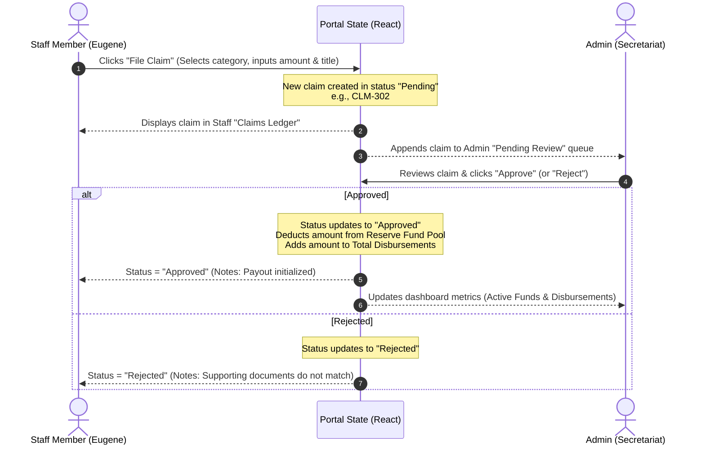

# HTU Staff Welfare Scheme — Application Flow & Architecture

Welcome to the **Ho Technical University (HTU) Staff Welfare Scheme** flow documentation. This document details the user journeys, state transitions, interactive simulations, and architectural flows implemented within the portal.

---

## 📌 System Overview & Roles

The HTU Staff Welfare Scheme is a centralized portal for university staff to contribute monthly dues, claim welfare benefits (medical, bereavement, wedding, retirement), and request emergency short-term loans. The platform simulates three distinct user roles:



---

## 🔄 Core Application Flows

### 1. Authentication & Role Selection Flow
- **Default Entry**: Users land on the dual-panel Login Screen (based on `login.html`).
- **Interactive Role Switcher**:
  - Toggling between **Staff Member**, **Welfare Committee**, and **System Auditor** updates the login configurations in real-time.
  - Clicking any of the **Quick Demo Access** buttons automatically logs the user in with the respective simulated credentials:
    - **Staff Member**: Logs in as `Eugene Dushie` (Senior Lecturer, Computer Science Dept, Premium Dues Tier).
    - **Welfare Committee**: Logs in as `Welfare Committee Officer` (Welfare Secretariat Admin).
    - **System Auditor**: Logs in as `System Audit Manager` (Read-only auditor).

---

### 2. Welfare Benefit Claim Flow
Staff members can submit claims for emergency financial assistance or milestone payouts.



---

### 3. Emergency Loan Flow
Staff members can request zero-interest emergency loans with predefined monthly installment terms.

```mermaid
graph TD
    Request[Staff member requests Loan] --> Validation[Welfare Code validates request]
    Validation --> Queue[Appears in Admin review list]
    
    Queue --> AdminDecision{Welfare Committee Decision}
    AdminDecision -->|Approved| Active[Loan status = Active]
    AdminDecision -->|Rejected| Rejected[Loan status = Rejected]
    
    Active --> FundImpact[Deducts amount from Reserve Fund Pool & adds to Outstanding Loans]
    Active --> RepaymentSim[Staff views installment dues & clicks "Settle Installment"]
    RepaymentSim --> RepayDone[Increases Reserve Fund, reduces Outstanding Loans, status set to Repaid]
```

---

### 4. Dues Contribution Flow
Staff members contribute a monthly fee (default GHS 100.00) to keep their welfare accounts active.
1. **Initiation**: Staff member clicks "Pay Monthly Dues" from the contributions tab or dashboard header.
2. **Simulation Dialog**: Displays payment options (Mobile Money sync).
3. **Completion**: 
   - A new contribution docket is created for the next calendar month (July 2026).
   - Generates a unique transaction reference (e.g. `WLF-TX-XXXX`).
   - Appends to the top of the **Contributions Statement** ledger.
   - Increases the global **Welfare Reserve Pool** balance.

---

## 💻 Simulation State Architecture

The application is built on top of client-side React hooks inside [app/page.js](file:///c:/Users/Eugene/Desktop/htu-welfare-system/app/page.js), managing real-time syncing between Staff actions and Admin panels:

| State Hooks | Scope | Description |
| :--- | :--- | :--- |
| `currentView` | Global Screen | Toggles screens between `'login'` and `'dashboard'`. |
| `userRole` | Role context | Tracks user context: `'staff'`, `'admin'`, or `'auditor'`. |
| `activeTab` | Component Tab | Manages active dashboard navigation tabs: overview, contributions, claims, loans, roster, settings. |
| `fundStats` | Financial Ledger | Tallies total reserve fund, disbursed claims, outstanding loan liabilities, and active members. |
| `claims` | Global Database | Stores all submitted claims, synchronized between staff ledgers and admin queues. |
| `loans` | Global Database | Stores all loan applications, outstanding balances, and repayment tracking variables. |
| `notifications` | Dropdown | Populates the topbar notification tray with real-time status updates (unread alerts). |

---

## 🛠️ Tech Stack & Styling Guidelines

- **Framework**: Next.js 16.2 (Turbopack) using the App Router.
- **Typography**: Imported from Google Fonts:
  - **EB Garamond** (serif) — Used for headings, numbers, and branding logos.
  - **DM Sans** (sans-serif) — Used for core interface typography, inputs, and tables.
- **Styling**: Tailwind CSS (v4) with bespoke custom branding colors:
  - `--navy` (`#1a2744`) — HTU Navy Blue.
  - `--navy-deep` (`#0f1829`) — Deep Background Navy.
  - `--gold` (`#c9a227`) — HTU Gold Accent.
  - `--cream` (`#f7f4ef`) — Panel & Page Background Cream.
- **Icons**: SVG-based `lucide-react` for smooth outline vector layouts.
